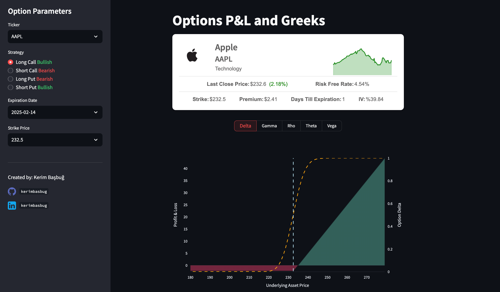

# **Options P&L and Greeks**

- A web application built with Streamlit that enables users to analyze option chains, compute Greeks, and visualize profit & loss (P&L) profiles in an intuitive and interactive way. By entering a stock ticker, the app fetches the option chain data and allows users to filter by expiration date, strike range, and option type (calls or puts). For each contract, the app calculates key option Greeks—Delta, Gamma, Theta, Vega, Rho—as well as Implied Volatility using the Black-Scholes model. 

- To support strategy evaluation, the app features a dynamic P&L graph that shows how potential profits or losses evolve across different underlying price levels. This helps users assess breakeven points, risk exposure, and potential returns for a given option position or strategy. Whether you're analyzing single options or building complex strategies, this tool provides actionable insights for traders of all levels.

To get started, visit the [Streamlit app](https://optiongreeksapp.streamlit.app/).

